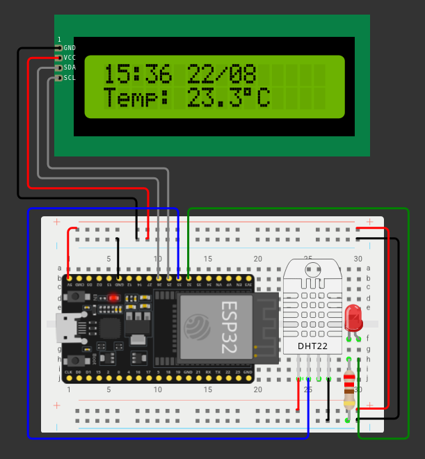

# 🌡️ Sistema de Monitoramento Térmico com ESP32

Este repositório contém a documentação, diagrama de circuito e código-fonte para o sistema de monitoramento de temperatura em tempo real com conectividade IoT, alertas visuais locais e sincronização temporal via protocolo NTP.

---

## 📌 Visão Geral do Projeto

O objetivo deste projeto é prover um monitoramento contínuo da temperatura ambiente para prevenção de superaquecimento em infraestruturas críticas (como data centers, estufas ou salas de servidores). 

O sistema realiza a leitura local, apresenta os dados e horários sincronizados via internet em um display LCD, controla um atuador visual (LED) de acordo com limites de criticidade e transmite os dados periodicamente para a nuvem através do **ThingSpeak**.

---

## 🛠️ Hardware e Componentes Utilizados

| Componente | Função |
| :--- | :--- |
| **ESP32** | Microcontrolador principal com conectividade Wi-Fi nativa |
| **DHT22** | Sensor de temperatura de precisão |
| **Display LCD 16x2 I2C** | Exibição local do horário sincronizado e da temperatura instantânea |
| **LED Vermelho** | Indicador visual para estados de Atenção e Alerta |
| **Protoboard & Jumpers** | Conexões físicas do circuito |

---

## ⚙️ Funcionalidades do Sistema

* **Sincronização de Hora Real (NTP):** Conecta-se a servidores `pool.ntp.org` via Wi-Fi para obter a hora oficial sem depender de módulo RTC externo.
* **Estados de Alerta Visual Local:**
  * **Normal (< 28.0 °C):** LED Desligado.
  * **Atenção (28.0 °C a 30.0 °C):** LED Piscando.
  * **Alerta Crítico (≥ 30.0 °C):** LED Ligado continuamente.
* **Telemetria na Nuvem (IoT):** Envio dos dados de temperatura a cada 20 segundos para a plataforma **ThingSpeak** via requisições HTTP GET.
* **Dashboard Interativo:** Visualização do histórico temporal por gráfico de linhas e mostrador do valor atual por ponteiro (*Gauge*).

---

## ☁️ Arquitetura de Comunicação e Nuvem

1. **Leitura:** ESP32 efetua a leitura do sensor DHT22.
2. **Processamento:** Atualiza a tela LCD e avalia a regra do LED.
3. **Envio:** Dispara pacote HTTP para a API REST do ThingSpeak:
   `http://api.thingspeak.com/update?api_key=SUA_KEY&field1=VALOR`
4. **Persistência:** Os dados são armazenados na nuvem e podem ser exportados em formato **CSV/Excel** para auditoria.

---

## 👨‍💻 Como Executar o Código

1. Instale a **Arduino IDE** e adicione o suporte às placas **ESP32**.
2. Instale as bibliotecas necessárias na Arduino IDE:
   * `LiquidCrystal_I2C`
   * `DHT sensor library`
3. Abra o arquivo `.ino` deste repositório, configure seu Wi-Fi (`ssid` e `password`) e insira sua **Write API Key** do ThingSpeak.
4. Conecte a ESP32 via USB e faça o Upload do programa.

---

### 🔌 Esquema do Circuito

---

## 🛠️ Implementação Física e Protótipo de Bancada

A simulação e a documentação principal deste repositório foram desenvolvidas no ambiente **Wokwi** utilizando a placa **ESP32** como referência de arquitetura. 

Para a validação prática, o projeto foi adaptado com sucesso para o hardware físico disponível (**ESP8266 / NodeMCU**), mantendo exatamente a mesma lógica de leitura de temperatura, regras de alerta e envio de dados para o ThingSpeak.

### 📸 Fotos da Montagem Real

### 📌 Mapeamento de Pinos (ESP8266 Física)
* **Sensor DHT22:** Pino `D5` (GPIO 14)
* **LED de Alerta:** Pino `D6` (GPIO 12)
* **Display LCD I2C:** `SDA` no pino `D2` (GPIO 4) e `SCL` no pino `D1` (GPIO 5)
